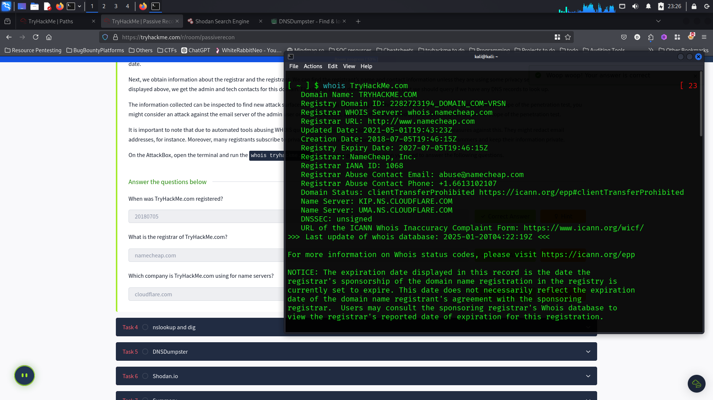
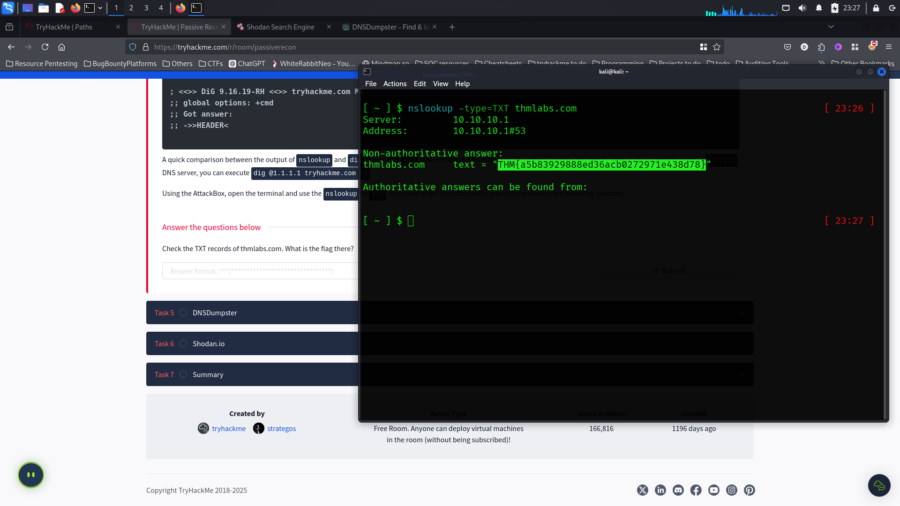
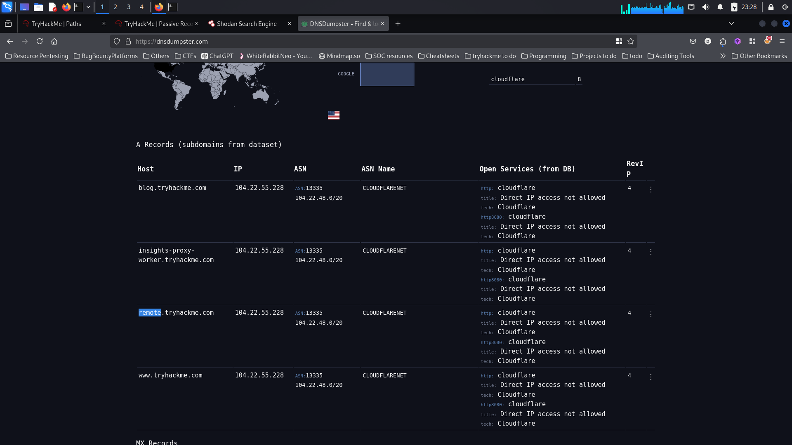
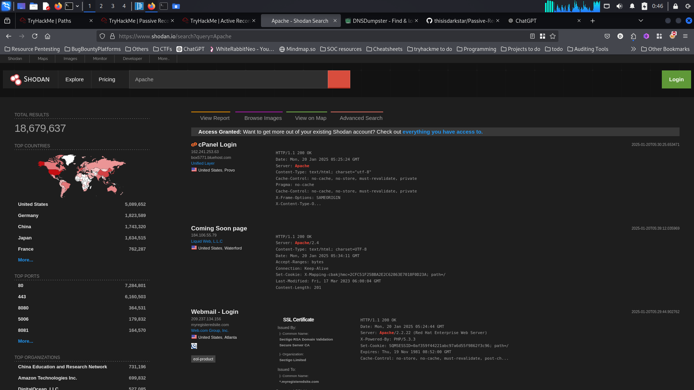
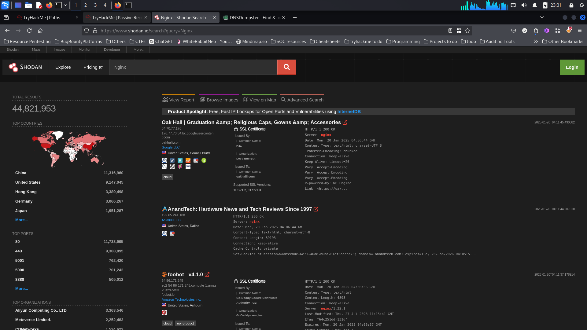

# Passive-Reconnaissance-TryHackMe

#### Description
Passive reconnaissance is the process of gathering information about a target system or network without directly interacting with it. This is typically done by collecting publicly available data, such as domain names, IP addresses, DNS records, WHOIS information, social media profiles, and more. The goal is to learn as much as possible about the target without alerting them to the investigation, making it an important technique for security professionals during the early stages of penetration testing or threat intelligence gathering.

**Reconnaissance** (recon) is the initial phase in gathering information about a target system or network, and it is critical in both offensive and defensive cybersecurity strategies. It is divided into two types:

+ **Passive Reconnaissance**: This involves collecting publicly available information without directly interacting with the target. Examples include checking DNS records, reading news articles, or reviewing job ads related to the target. The goal is to learn about the target discreetly.

+ **Active Reconnaissance**: This requires direct interaction with the target, such as connecting to company servers, engaging in social engineering, or physically infiltrating premises. Active recon is more intrusive and can alert the target.

**WHOIS** is a query and response protocol used to retrieve information about domain names, IP addresses, and other registered entities on the internet. It provides details such as the domain registrant, contact information, registration dates, and name servers. WHOIS is commonly used in both passive reconnaissance and domain management to gather information about a target or verify ownership of a domain. This publicly accessible data can help attackers identify potential targets or gain insights into the infrastructure of an organization. It is also useful for network administrators and security professionals for troubleshooting or domain validation.

Questions : 
**When was TryHackMe.com registered?**
**What is the registrar of TryHackMe.com?**
**Which company is TryHackMe.com using for name servers?**
used : `whois TryHackMe.com``

**`nslookup`** is a command-line tool used to query DNS records and gather information about a domain. It helps in resolving domain names to IP addresses, checking mail server (MX) records, and troubleshooting DNS issues.

### **Key Features**:
- **Non-interactive mode**: Use `nslookup [domain]` to get the IP address or other DNS records.
- **Interactive mode**: Use `nslookup` to query multiple DNS records in one session.
- **Specify DNS server**: You can query specific DNS servers with `nslookup [domain] [DNS server]`.

### **Common Uses**:
- Resolving domain names to IP addresses.
- Fetching DNS records like MX, A, or NS.
- Troubleshooting DNS problems.

It's a crucial tool for network administrators and cybersecurity professionals.

Questions: 
**Check the TXT records of thmlabs.com. What is the flag there?**
used : `nslookup -type=TXT thmlabs.com``

**`dnsdumpster`** is an online DNS reconnaissance tool that allows users to gather detailed information about a target's DNS records. It helps security professionals and attackers alike to perform passive reconnaissance by identifying domain names, subdomains, associated IP addresses, mail servers, and more. The tool provides a comprehensive view of a target's domain infrastructure by querying DNS servers.

### **Key Features**:
- **Domain Discovery**: Identifies subdomains and IP addresses related to the target domain.
- **DNS Record Analysis**: Provides information on various DNS records, such as A, MX, NS, TXT, and more.
- **Historical Data**: Can display past DNS records for a domain if available.

### **Usage**:
`dnsdumpster` is typically used to:
- Gather information for penetration testing and security assessments.
- Discover hidden subdomains or misconfigured DNS records.
- Aid in threat intelligence by analyzing DNS data of a target.

**How to Use**:
1. Visit the `dnsdumpster` website (https://dnsdumpster.com).
2. Enter a domain name to retrieve DNS information.
3. View the results, which include IP addresses, mail servers, and associated domains.

Overall, `dnsdumpster` is a valuable tool for conducting passive reconnaissance without alerting the target.

Questions : 
**Lookup tryhackme.com on DNSDumpster. What is one interesting subdomain that you would discover in addition to www and blog?**

**Shodan.io** is a powerful search engine that allows users to find and explore devices connected to the internet. Unlike traditional search engines that index websites, Shodan scans the internet for various types of devices, including servers, routers, webcams, IoT devices, and other networked systems. It collects metadata about these devices, such as their IP addresses, open ports, operating systems, services running, and vulnerabilities.

### **Key Features**:
- **Device Discovery**: Allows users to search for internet-connected devices based on various filters like location, device type, software, or vulnerabilities.
- **Service and Port Scanning**: Identifies open ports and services running on devices, helping to find exposed or misconfigured devices.
- **Vulnerability Assessment**: Shows devices with known vulnerabilities, aiding security professionals in identifying potential attack vectors.
- **Geolocation**: Provides information on where devices are located geographically.

### **Common Uses**:
- **Cybersecurity and Penetration Testing**: Security professionals use Shodan to identify vulnerable devices and services, and assess potential risks.
- **IoT Device Exploration**: Researchers and attackers can explore unsecured IoT devices and networks.
- **Network Mapping**: Helps map out devices and services on a network or globally.

### **How to Use**:
1. Visit [Shodan.io](https://www.shodan.io).
2. Use the search bar to look for devices by entering keywords such as IP addresses, device types (e.g., "webcam"), or services (e.g., "SSH").
3. Refine results using filters like country, city, or operating system.

Questions : 
**According to Shodan.io, what is the 2nd country in the world in terms of the number of publicly accessible Apache servers?**
**Based on Shodan.io, what is the 3rd most common port used for Apache?**
just searched : 'Apache'

**Based on Shodan.io, what is the 3rd most common port used for nginx?**
searched : 'Nginx'

